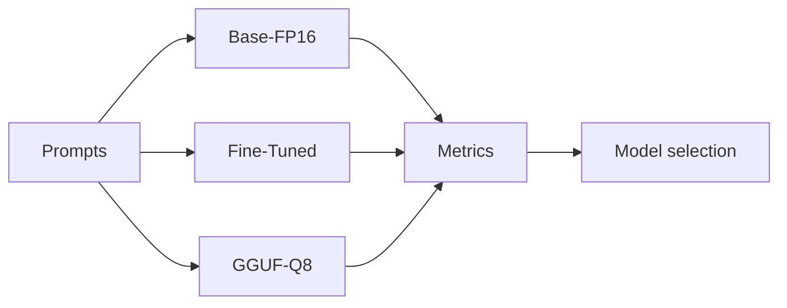
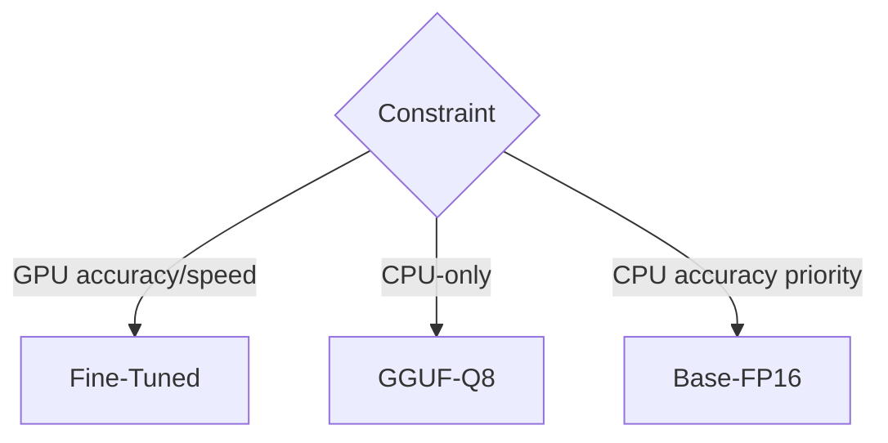

# Benchmark Report (Day 4)

## Objective
Compare `Base-FP16`, `Fine-Tuned`, and `GGUF-Q8` on speed, latency, memory, and semantic accuracy.

## Test Setup
| Item | Value |
|---|---|
| Tasks | QA, Reasoning, Extraction |
| Accuracy metric | Cosine similarity (`BAAI/bge-base-en-v1.5`) |
| Max new tokens | 128 |
| Engines | Transformers, llama.cpp |

## CPU Results
| Model | Engine | Batch | Tok/s | Time (s) | VRAM MB | Accuracy |
|---|---|---:|---:|---:|---:|---:|
| Base-FP16 | transformers | 1 | 14.40 | 0.49 | 0 | 0.861 |
| Fine-Tuned | transformers | 3 | 5.78 | 52.62 | 0 | 0.826 |
| GGUF-Q8 | llama.cpp | 3 | 11.46 | 12.13 | 0 | 0.700 |

## GPU Results (Colab)
| Model | Engine | Batch | Tok/s | Latency (s) | VRAM MB | Accuracy |
|---|---|---:|---:|---:|---:|---:|
| Base-FP16 | transformers | 3 | 32.52 | 8.27 | 2601.86 | 0.744 |
| Fine-Tuned | transformers | 3 | 72.68 | 4.15 | 2602.86 | 0.853 |
| GGUF-Q8 | llama.cpp CPU | 3 | 4.62 | 49.99 | 0 | 0.820 |

## Decisions
| Use case | Model |
|---|---|
| Highest GPU accuracy + throughput | Fine-Tuned |
| CPU-only deployment | GGUF-Q8 |
| Highest local CPU accuracy in this run | Base-FP16 |

## Mermaid Diagram — Benchmark Flow

## Mermaid Diagram — Selection Logic

