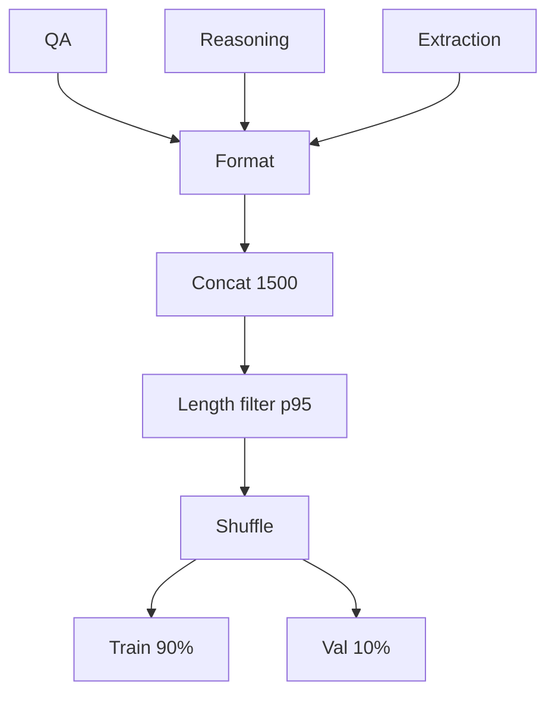
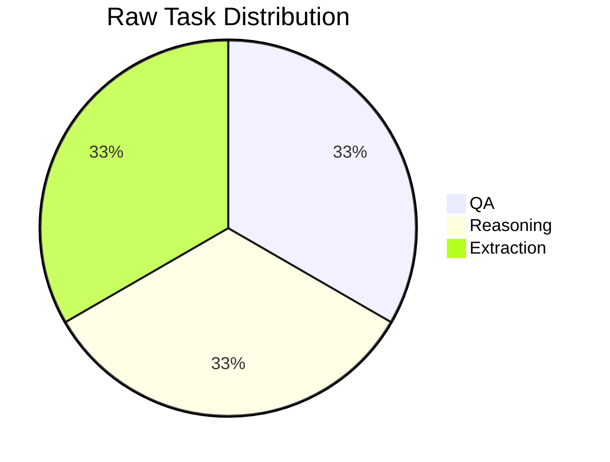

# Dataset Analysis (Day 1)

## Goal
Build a medical instruction dataset for three tasks: QA, reasoning, and extraction.

## Sources
| Task | Dataset | Source |
|---|---|---|
| QA | `medalpaca/medical_meadow_medical_flashcards` | Hugging Face |
| Reasoning | `FreedomIntelligence/medical-o1-reasoning-SFT` | Hugging Face |
| Extraction | `Fine-Tuning-LLMs-for-Medical-Entity-Extraction` | GitHub |

## Unified Schema
```json
{"instruction":"...","input":"...","output":"..."}
```

## Pipeline
1. Load each dataset.
2. Shuffle with `SEED=42`.
3. Select `500` samples per task.
4. Format to unified schema.
5. Concatenate (`1500` raw samples).
6. Remove token-length outliers above the `95th percentile`.
7. Shuffle and split `90/10`.
8. Save `data/train.jsonl` and `data/val.jsonl`.

## Key Settings
| Parameter | Value |
|---|---|
| Samples per task | 500 |
| Raw total | 1500 |
| Outlier rule | `> p95` token length |
| Split | 90% train / 10% val |
| Seed | 42 |

## Mermaid Diagram — Data Flow


## Mermaid Diagram — Raw Mix

