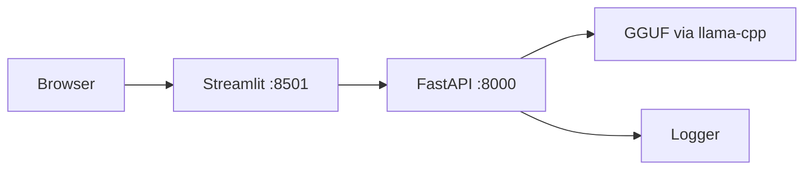
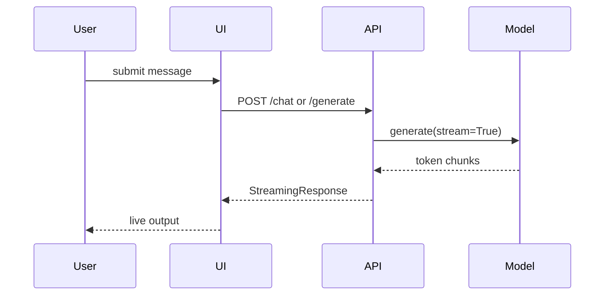

# Final Report (Day 5)

## Objective
Deploy a local medical LLM stack with streaming API and Streamlit UI using Docker.

## Components
| Component | Responsibility |
|---|---|
| `deploy/app.py` | FastAPI endpoints: `/generate`, `/chat` |
| `deploy/model_loader.py` | Thread-safe singleton GGUF loader |
| `deploy/config.py` | Runtime defaults (`MAX_TOKENS`, `TOP_P`, etc.) |
| `deploy/logger.py` | Request and latency logging |
| `deploy/ui.py` | Streamlit chat and single-prompt UI |

## API Summary
| Endpoint | Input | Output |
|---|---|---|
| `POST /generate` | single `prompt` | streamed `text/plain` |
| `POST /chat` | list of `messages` | streamed `text/plain` + `X-Request-ID` |

## Run
```bash
docker-compose up --build
```

Services:
- Backend: `http://localhost:8000`
- UI: `http://localhost:8501`
- Docs: `http://localhost:8000/docs`

## Mermaid Diagram — Architecture


## Mermaid Diagram — Streaming Request

