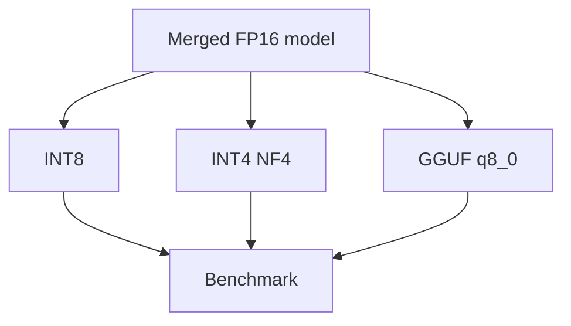
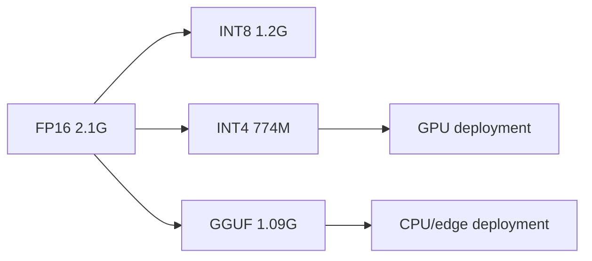

# Quantisation Report (Day 3)

## Objective
Convert merged TinyLlama weights from FP16 into smaller deployable formats and compare size/speed.

## Input Model
| Item | Value |
|---|---|
| Base | `TinyLlama/TinyLlama-1.1B-Chat-v1.0` |
| Adapter source | `/content/adapters` |
| Merge method | `merge_and_unload()` |

## Outputs
| Format | Path | Typical runtime |
|---|---|---|
| FP16 | `/content/quantized/model-fp16` | GPU |
| INT8 | `/content/quantized/model-int8` | GPU |
| INT4 (NF4) | `/content/quantized/model-int4` | GPU |
| GGUF Q8_0 | `/content/quantized/model.gguf` | CPU/edge |

## Benchmark Snapshot
| Format | Size | Speed |
|---|---|---|
| FP16 | 2.1G | 32.82 tok/s |
| INT8 | 1.2G | 9.02 tok/s |
| INT4 | 774M | 21.55 tok/s |
| GGUF Q8 (CPU) | 1.09 GB | 16.78 tok/s |

## Findings
- INT4 gave the best size reduction on GPU path.
- INT8 was slower than FP16 in this setup.
- GGUF Q8 enabled practical CPU inference.

## Mermaid Diagram — Quantisation Workflow

## Mermaid Diagram — Size/Deployment Path

