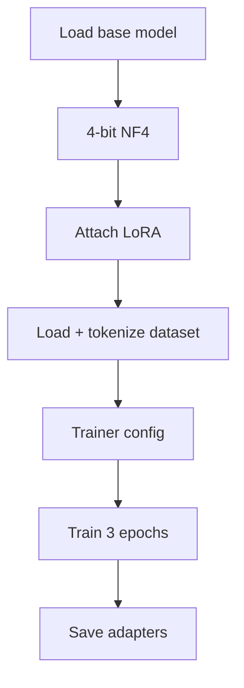
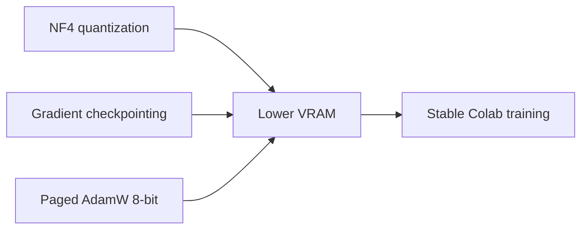

# Training Report (Day 2)

## Objective
Fine-tune TinyLlama for medical instructions using QLoRA on Colab GPU.

## Base Setup
| Item | Value |
|---|---|
| Model | `TinyLlama/TinyLlama-1.1B-Chat-v1.0` |
| Quantization | 4-bit NF4 |
| Method | LoRA (`q_proj`, `v_proj`) |
| Dataset | `train.jsonl`, `val.jsonl` |

## Core Hyperparameters
| Group | Key values |
|---|---|
| LoRA | `r=16`, `alpha=32`, `dropout=0.05` |
| Training | batch `4`, lr `2e-4`, epochs `3` |
| Precision | `fp16`, `paged_adamw_8bit` |
| Sequence | `max_length=256` |

## Training Outcome
| Metric | Result |
|---|---|
| Trainable params | ~1% |
| Loss trend | Improved over epochs |
| Output | LoRA adapters saved |

Artifacts saved in `/content/adapters`.

## Mermaid Diagram — Training Flow

## Mermaid Diagram — Memory Strategy

