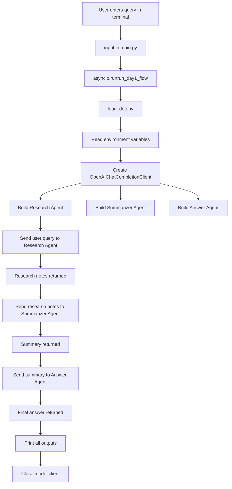
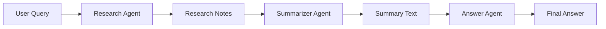
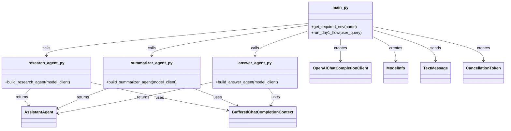
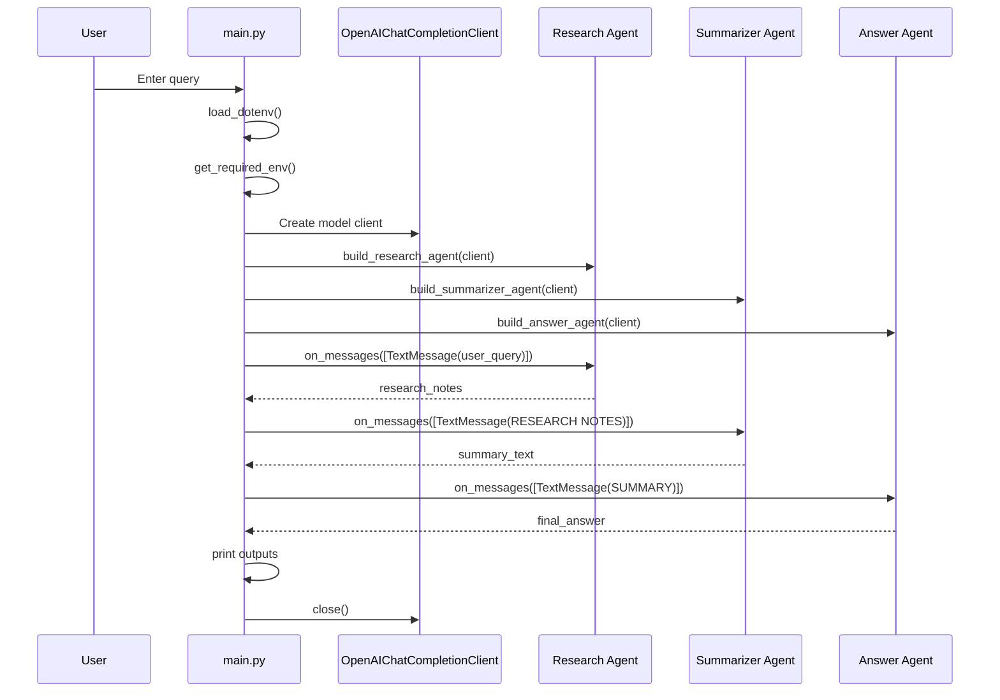

# AutoGen + LM Studio Multi-Agent Pipeline

A lightweight multi-agent project built with **AutoGen** and an **OpenAI-compatible LM Studio endpoint**.

This project runs a simple **3-stage sequential pipeline**:

1. **Research Agent** gathers structured notes from the user query
    
2. **Summarizer Agent** compresses those notes
    
3. **Answer Agent** turns the summary into the final polished response
    

---

## Overview

This project is a **role-based multi-agent pipeline** where each agent has a separate responsibility, but all agents use the **same underlying model client**. The difference in behavior comes from their different `system_message` instructions. Each agent is created as an `AssistantAgent` and uses a `BufferedChatCompletionContext(buffer_size=10)`.

So the architecture is:

- one shared LM Studio-backed model client
    
- three specialized agents
    
- linear execution from one agent to the next
    
- printed intermediate outputs for visibility/debugging
    

---

## Tech Stack

- Python
    
- AutoGen AgentChat
    
- AutoGen OpenAI extension
    
- LM Studio via OpenAI-compatible API
    
- dotenv for environment variable loading
    

---

## Dependencies

```txt
autogen-agentchat
autogen-ext[openai]
openai
```

These are the packages shown in your `requirements.txt`.

---

## Project Structure

```text
.
├── AGENT-FUNDAMENTALS.MD
├── agents
│   ├── answer_agent.py
│   ├── __init__.py
│   ├── research_agent.py
│   └── summarizer_agent.py
├── .env
├── main.py
├── python_project_dump.md
└── requirements.txt
```

This structure comes directly from the uploaded dump.

---

## How the Project Works

The flow starts in `main.py`.

`main.py` does the following:

- loads environment variables using `load_dotenv()`
    
- reads `MODEL_NAME`, `BASE_URL`, `API_KEY`, and `TEMPERATURE`
    
- creates a single `OpenAIChatCompletionClient`
    
- builds the three agents
    
- sends the user query through the three agents in sequence
    
- prints every stage’s output
    
- closes the model client at the end
    

This means your project is **not yet a planner-based orchestrator** or tool-using autonomous system. Right now it is a **clean sequential pipeline**.

---

## Execution Flow Diagram



This reflects the linear `on_messages()` chain in `main.py`.

---

## Agent-to-Agent Flow



The intermediate outputs are explicitly passed from one agent to the next rather than being hidden.

---

## Class / Object Diagram

Your code does **not define custom classes of its own**. Instead, it defines **factory functions** that create configured instances of AutoGen classes like `AssistantAgent`, `OpenAIChatCompletionClient`, and `BufferedChatCompletionContext`.



That diagram matches the actual code structure from the dump.

---

## Sequence Diagram



This sequence is exactly how your current code is wired.

---

## File-by-File Explanation

### `main.py`

This is the main entrypoint and orchestration file.

It is responsible for:

- loading `.env`
    
- validating required environment variables
    
- creating the model client
    
- building agents
    
- executing them in order
    
- printing outputs
    
- cleaning up resources at the end
    

### `agents/research_agent.py`

This file defines `build_research_agent(model_client)`.

Its job is to create an `AssistantAgent` whose prompt tells it to:

- gather useful information
    
- create structured notes
    
- avoid summarizing
    
- avoid giving the final polished answer
    

### `agents/summarizer_agent.py`

This file defines `build_summarizer_agent(model_client)`.

Its job is to:

- compress research notes
    
- organize information clearly
    
- reduce clutter
    
- avoid becoming the final answer generator
    

### `agents/answer_agent.py`

This file defines `build_answer_agent(model_client)`.

Its job is to:

- take the summary
    
- produce the final user-facing answer
    
- make the response polished and clear
    

### `agents/__init__.py`

This is just a package marker file, so Python can treat `agents/` as a package.

### `requirements.txt`

This file lists the required libraries for the project.

---

## Environment Variables

The code expects these values:

```env
MODEL_NAME=<your-model-name>
BASE_URL=<your-lm-studio-openai-compatible-url>
API_KEY=lm-studio
TEMPERATURE=0.2
```

`MODEL_NAME` and `BASE_URL` are treated as required. If either is missing, `get_required_env()` raises a runtime error. `API_KEY` and `TEMPERATURE` use defaults if not set.

---

## How Role Separation Works

All three agents use the **same model backend**, but they behave differently because each one has a different `system_message`. That means the specialization in your system comes from **prompt-based role separation**, not from different model weights or different model endpoints.

So in simple words:

- same model
    
- different instructions
    
- different outputs per stage
    

---

## Current Strengths

- very easy to understand
    
- clear separation of concerns
    
- explicit multi-stage processing
    
- good for learning AutoGen basics
    
- easy to extend later
    
- prints intermediate outputs, which is useful for debugging and demos
    

---

## Current Limitations

This project currently does **not** include:

- tool calling
    
- planner/orchestrator logic
    
- validator/critic loop
    
- reflection loop
    
- memory persistence across runs
    
- retrieval or RAG
    
- web search
    
- failure recovery
    
- dynamic agent routing
    
- parallel execution
    

That conclusion comes from the actual visible files and the linear flow in `main.py`.

---

## How to Run

Start your LM Studio server first, then run:

```bash
python main.py
```

The script asks for input in the terminal, then processes the query through all three agents and prints each stage’s result.

---

## Example Mental Model

You can explain this architecture like this:

- **Research Agent** = analyst
    
- **Summarizer Agent** = editor
    
- **Answer Agent** = presenter
    

Instead of one model doing everything in one shot, your project splits the work into three cleaner roles.

---

## Future Improvements

If you want to extend this into a stronger project later, the best next additions would be:

1. planner agent
    
2. validator/critic agent
    
3. tool calling
    
4. memory layer
    
5. logging/tracing
    
6. API layer with FastAPI
    
7. retry/fallback logic
    
8. structured outputs or JSON mode
    

These are suggestions for extension, not features currently present in the uploaded dump.

---

## Short Summary

This project is a **3-agent sequential AutoGen pipeline** using **LM Studio as an OpenAI-compatible backend**. It creates three specialized `AssistantAgent` instances — research, summarizer, and answer — and passes the output of one into the next to generate a final response. The design is simple, clean, and good as a foundational multi-agent architecture.

---
