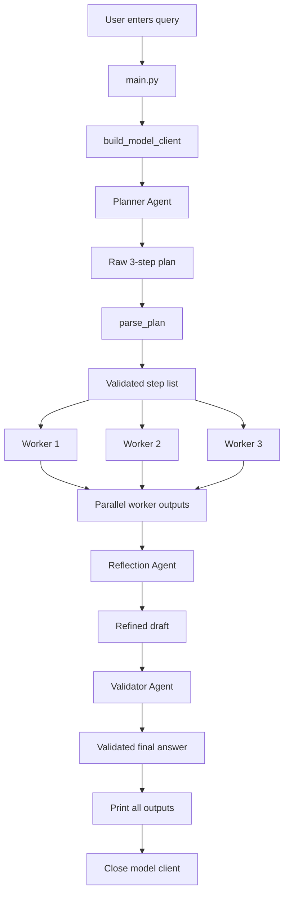
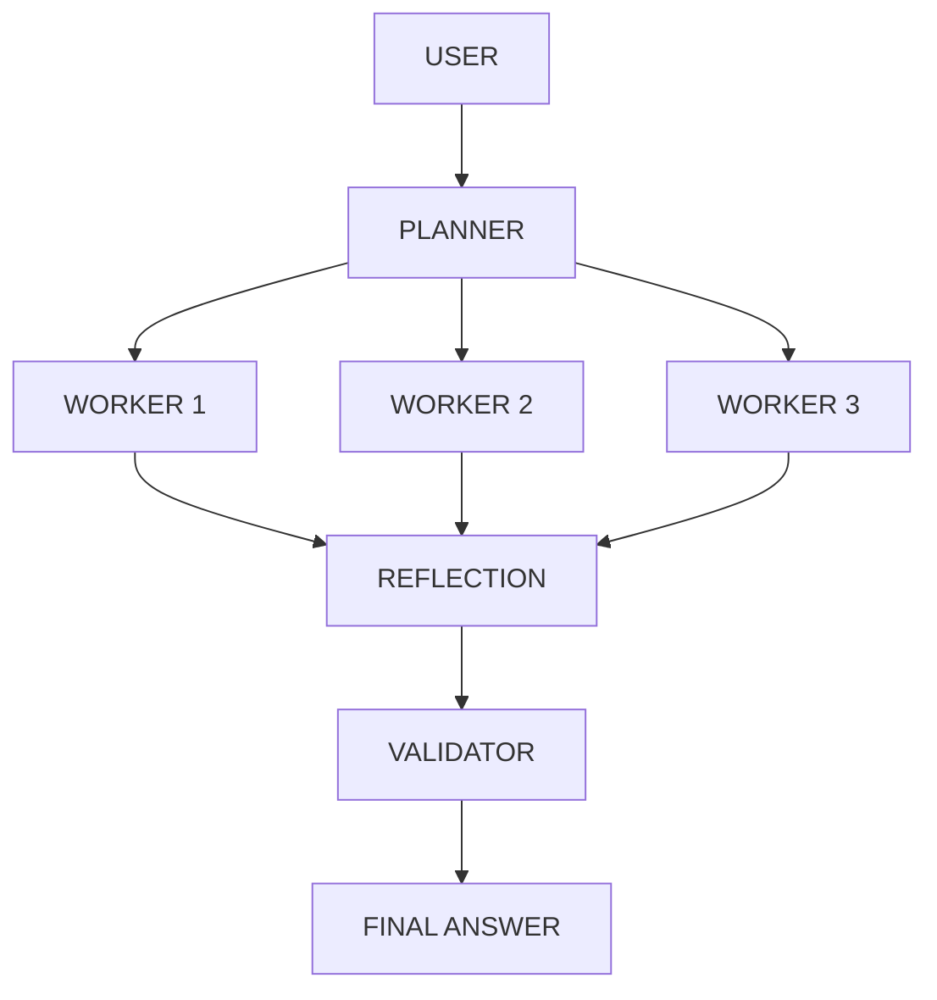
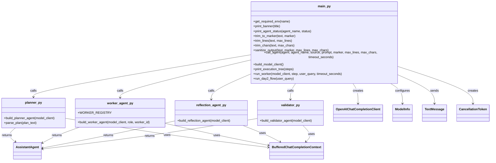
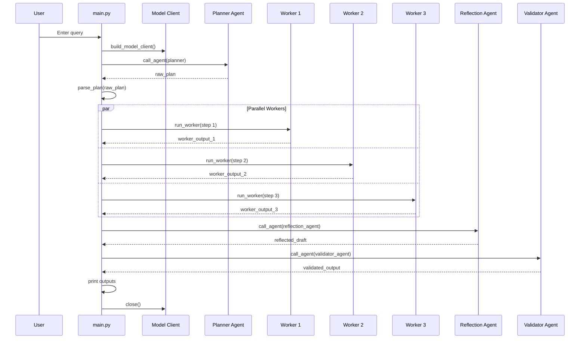
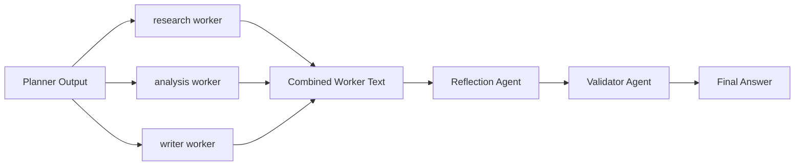

# AutoGen + LM Studio Multi-Agent Orchestrated Pipeline (Day 2)

A role-based multi-agent system built with **AutoGen** and **LM Studio** using an OpenAI-compatible API.

This Day 2 version improves the earlier sequential pipeline by introducing:

- a **Planner Agent** that breaks the task into 3 steps
    
- **parallel worker agents**
    
- a **Reflection Agent** that merges worker outputs
    
- a **Validator Agent** that checks and corrects the final draft
    
- timeout and output-sanitization helpers for safer execution
    

---

## Overview

This project is a **mini orchestrated multi-agent architecture**.

Instead of sending the user query through a fixed linear research → summarize → answer chain, the system now:

1. asks a **Planner Agent** to generate exactly 3 worker tasks
    
2. parses that plan
    
3. spawns 3 worker agents based on the planned roles
    
4. runs those workers in parallel using `asyncio.gather(...)`
    
5. combines their outputs
    
6. sends the merged result to a **Reflection Agent**
    
7. sends the reflection result to a **Validator Agent**
    
8. prints every stage of execution
    

---

## Tech Stack

- Python
    
- AutoGen AgentChat
    
- AutoGen OpenAI extension
    
- LM Studio via OpenAI-compatible API
    
- asyncio for async execution and concurrency
    

---

## Dependencies

```txt
autogen-agentchat
autogen-ext[openai]
```

These are the packages listed in your uploaded `requirements.txt`.

---

## Project Structure

```text
.
├── agents
│   ├── __init__.py
│   ├── reflection_agent.py
│   ├── validator.py
│   └── worker_agent.py
├── clean_dump.md
├── .env
├── FLOW-DIAGRAM.md
├── main.py
├── orchestrator
│   └── planner.py
├── python_project_dump.md
└── requirements.txt
```

This structure comes directly from the Day 2 dump you uploaded.

---

## What Is New in Day 2

Day 2 moves from a simple sequential handoff pipeline to a more agentic orchestration pattern.

### New additions in this version

- planner-driven task decomposition
    
- worker registry for role-based worker selection
    
- parallel worker execution
    
- reflection stage
    
- validator stage
    
- utility helpers for trimming/sanitizing output
    
- timeout handling per agent call
    

So this is a meaningful upgrade in architecture, not just a prompt change.

---

## High-Level Flow



This reflects the real control flow inside `run_day2_flow()`.

---

## Execution Tree

Your code even prints an execution tree using `print_execution_tree(steps)`, showing the hierarchy as:

- User
    
- Planner
    
- Workers
    
- Reflection
    
- Validator
    
- Final Answer
    

A visual representation of that same structure:



That is exactly how the code is designed to operate.

---

## Class / Object Diagram

Like Day 1, your own code still mostly uses **functions**, not custom Python classes. The actual runtime objects are instances of AutoGen classes created by your builder functions.



This diagram matches the actual code organization in your dump.

---

## Sequence Diagram



That parallel worker section comes from `asyncio.gather(...)` inside `run_day2_flow()`.

---

## Main Components

## `main.py`

This file is the central orchestrator.

It contains:

- configuration loading
    
- helper functions for cleanup/trimming
    
- a generic `call_agent(...)` wrapper
    
- the model-client builder
    
- worker execution logic
    
- the full Day 2 execution flow
    

### Important helpers in `main.py`

#### `get_required_env(name)`

Reads an environment variable and raises an error if it is missing. This is used for `MODEL_NAME` and `BASE_URL`.

#### `trim_to_marker(text, marker)`

Cuts output at a specific marker if the marker exists.

#### `trim_lines(text, max_lines)`

Keeps only a limited number of non-empty lines.

#### `trim_chars(text, max_chars)`

Caps the maximum character length.

#### `sanitize_output(...)`

Combines marker trimming, line trimming, and character trimming into one cleanup function.

This is important because it reduces messy or overlong model outputs before they are passed to later stages.

#### `call_agent(...)`

This is the generic wrapper used for planner, workers, reflection, and validator.

It:

- prints started/finished status
    
- sends the message to the agent
    
- enforces timeout with `asyncio.wait_for(...)`
    
- sanitizes output
    
- returns a timeout message if the call exceeds the limit
    

This function is a core part of your architecture because it standardizes all agent calls.

#### `build_model_client()`

Builds the `OpenAIChatCompletionClient` using:

- `MODEL_NAME`
    
- `BASE_URL`
    
- `API_KEY`
    
- `TEMPERATURE`
    
- `MAX_TOKENS`
    

#### `run_worker(...)`

Creates one worker based on the plan step and sends it a prompt containing:

- user query
    
- step number
    
- role
    
- goal
    

#### `run_day2_flow(...)`

This is the full pipeline controller:

- planner call
    
- parse plan
    
- fallback default plan if parsing fails
    
- execution tree print
    
- parallel workers
    
- reflection
    
- validation
    
- output printing
    
- client close
    

---

## `orchestrator/planner.py`

This file defines the planner stage.

### `build_planner_agent(model_client)`

Creates a planner `AssistantAgent`.

Its prompt forces the model to:

- create exactly 3 worker tasks
    
- use only roles `research`, `analysis`, and `writer`
    
- output in a strict 4-line format
    
- end with `<END_PLAN>`
    

### `parse_plan(plan_text)`

Uses a regex to extract:

- step number
    
- role
    
- goal
    

This is important because the planner output is not trusted blindly. It is parsed into structured Python dictionaries before execution.

---

## `agents/worker_agent.py`

This file contains the worker system.

### `WORKER_REGISTRY`

Maps worker roles to role-specific system prompts:

- `research`
    
- `analysis`
    
- `writer`
    

### `build_worker_agent(model_client, role, worker_id)`

Builds a worker dynamically based on the role from the planner output.

If the role is invalid, it defaults to `analysis`.

This gives your architecture a limited but real **registry-based dynamic role selection**.

---

## `agents/reflection_agent.py`

This file builds the reflection stage.

The Reflection Agent is instructed to:

- combine worker outputs
    
- produce one improved draft
    
- return a strict `REFINED_DRAFT:` format
    
- stay within 110 words
    
- stop at `<END_REFLECTION>`
    

This stage acts like a synthesizer that merges parallel branches back into one coherent answer.

---

## `agents/validator.py`

This file builds the validation stage.

The Validator Agent is instructed to:

- review for errors, contradictions, missing pieces, and weak logic
    
- return either `STATUS: PASS` or `STATUS: NEEDS_REVISION`
    
- always include `FINAL_ANSWER`
    

This makes the validator both:

- a quality-checking layer
    
- a final-correction layer
    

---

## Worker Role Flow



This mirrors the actual aggregation logic in `combined_worker_text` and the reflection/validation calls afterward.

---

## Fallback Logic

If the planner does not return exactly 3 valid steps, the code falls back to a default plan:

1. research → find main functions and features
    
2. analysis → explain components, data flow, and tradeoffs
    
3. writer → draft a short user-friendly architecture answer
    

That makes the pipeline more robust than Day 1 because it does not completely depend on planner formatting being perfect.

---

## Why This Architecture Is Better Than Day 1

Day 1 was a fixed sequential chain. Day 2 adds more realistic agent-system behaviors:

- planning
    
- limited dynamic task assignment
    
- worker specialization
    
- parallel execution
    
- synthesis/reflection
    
- validation
    
- timeout handling
    
- fallback plan logic
    

So this version is much closer to a true orchestrated multi-agent design.

---

## Strengths

- better separation of concerns
    
- planner-based structure
    
- concurrent workers for efficiency
    
- reflection improves coherence
    
- validator improves quality
    
- output cleanup reduces messy responses
    
- fallback behavior improves reliability
    

---

## Current Limitations

This project still does **not** include:

- tool calling
    
- external memory persistence
    
- web search
    
- retrieval/RAG
    
- true dynamic number of workers
    
- human feedback loop
    
- retry-on-failure beyond timeout return text
    
- structured JSON enforcement from the model itself
    

Also, while workers run in parallel, the roles are still constrained to the fixed registry of `research`, `analysis`, and `writer`.

---

## How to Run

Run:

```bash
python main.py
```

The program prompts for a query, executes the planner → workers → reflection → validator pipeline, then prints all stages.

---

## Simple Mental Model

You can explain this system like this:

- **Planner** = project manager
    
- **Workers** = specialists doing parallel tasks
    
- **Reflection Agent** = editor combining all drafts
    
- **Validator Agent** = reviewer checking and correcting the result
    

That is the cleanest viva/interview explanation of your Day 2 design.

---

## Short Summary

This Day 2 project is a **planner-led multi-agent architecture** built with AutoGen and LM Studio. It generates a 3-step plan, creates role-based workers, executes them in parallel, merges their outputs through reflection, validates the final draft, and prints all intermediate stages. Compared with Day 1, this is a clear architectural step forward toward a more agentic system.

---

If you want, next I can do one more version of this same README in **very simple instructor language**, so you can explain it in class without getting stuck.