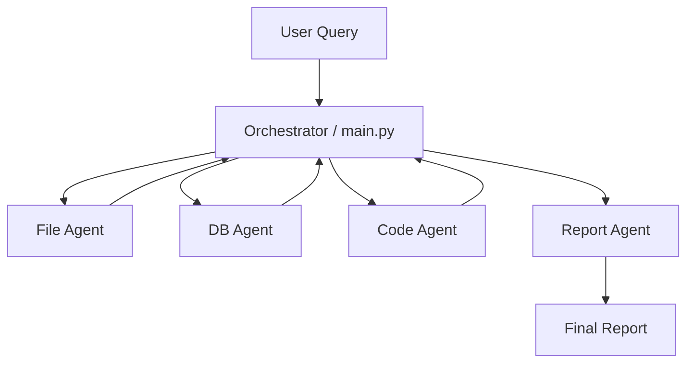
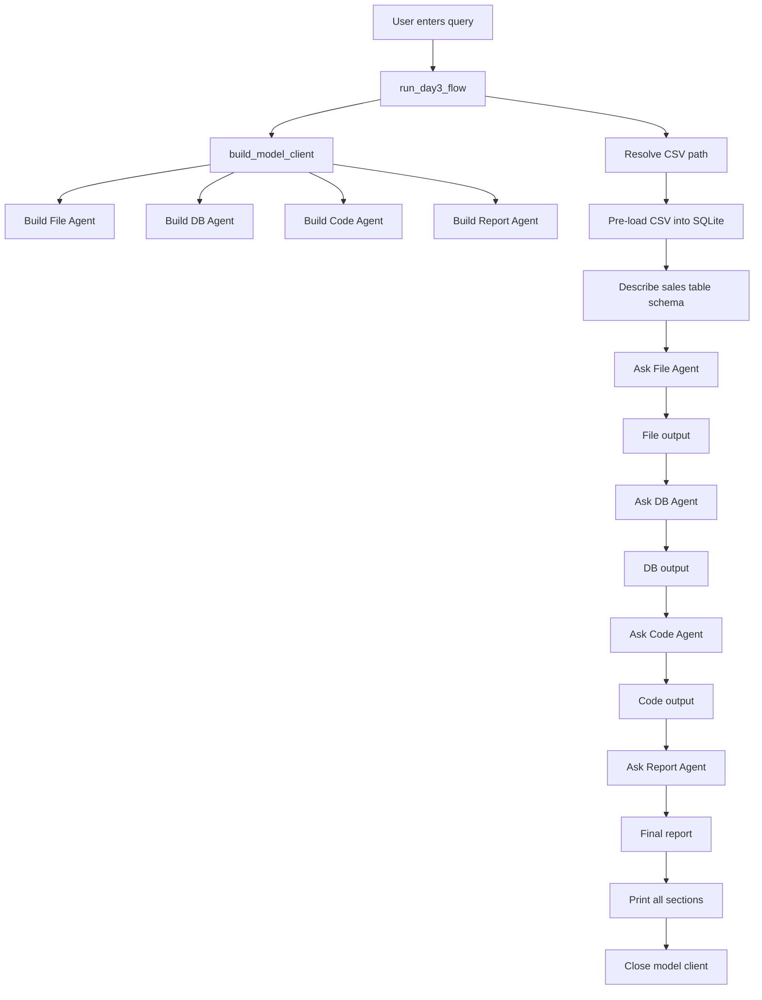
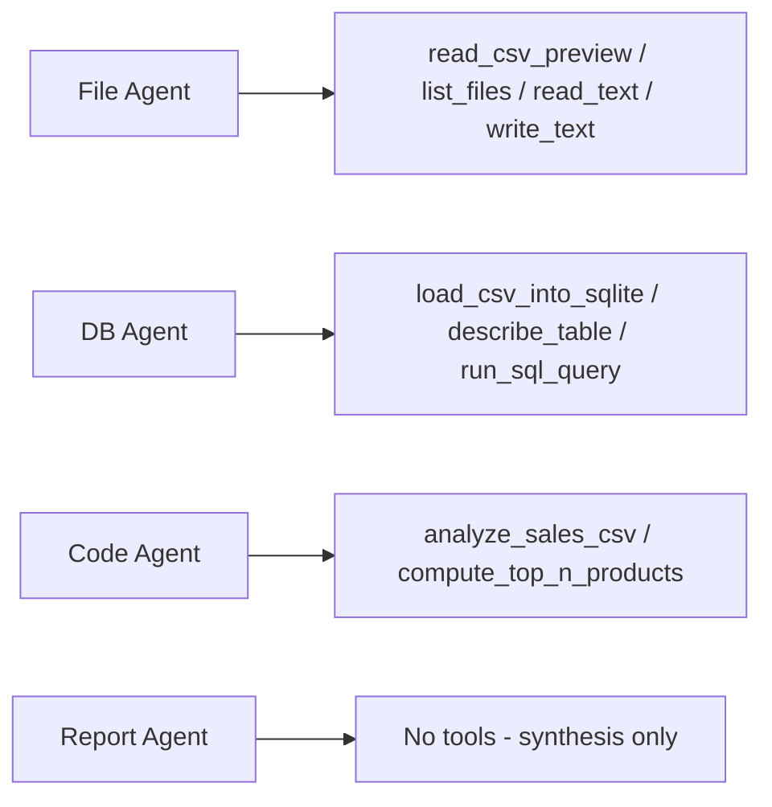
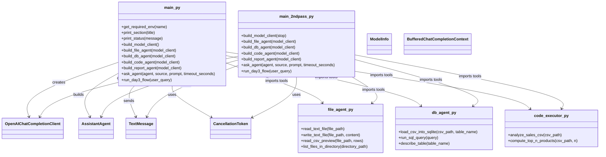
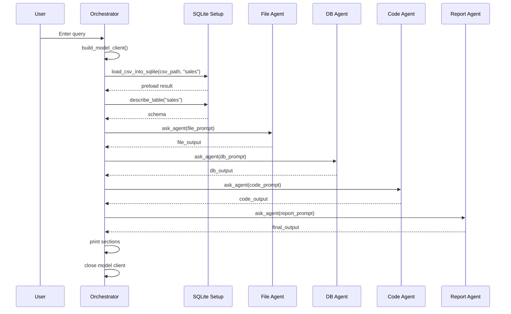
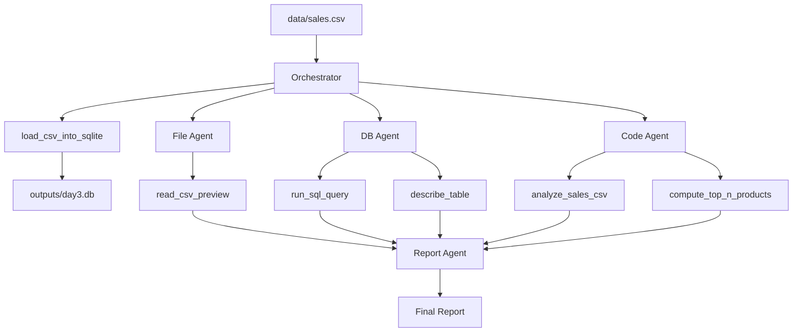

# Day 3 — Tool-Calling Multi-Agent System with AutoGen + LM Studio

A multi-agent project built with **AutoGen** and **LM Studio**, where agents do not rely only on prompting — they use **registered tools** for file handling, SQLite queries, and Python/pandas analysis.

This Day 3 system is centered on a sales-analysis workflow using:

- a **File Agent** for CSV inspection
    
- a **DB Agent** for SQL-based analysis
    
- a **Code Agent** for pandas/Python analysis
    
- a **Report Agent** for final synthesis
    

---

## Overview

This project analyzes `data/sales.csv` using three specialist agents and one synthesizer agent.

The orchestrator:

1. prepares the CSV/database context
    
2. asks the File Agent to inspect the dataset
    
3. asks the DB Agent to run a revenue-by-region SQL query
    
4. asks the Code Agent to compute business insights and top products
    
5. sends all outputs to the Report Agent for the final report
    

Unlike Day 1 and Day 2, this project introduces **real tool use** through AutoGen tool registration. That means the agent is not just “pretending” to inspect files or run queries — it can actually call Python functions you registered in `tools/`.

---

## Tech Stack

- Python
    
- AutoGen AgentChat
    
- AutoGen OpenAI extension
    
- LM Studio via OpenAI-compatible API
    
- pandas
    
- sqlite3
    
- asyncio
    

---

## Dependencies

```txt
autogen-agentchat
autogen-ext[openai]
pandas
```

These are the dependencies shown in your uploaded `requirements.txt`.

---

## Project Structure

```text
.
├── data
│   └── sales.csv
├── .env
├── files
├── main_2ndpass.py
├── main.py
├── outputs
│   └── day3.db
├── python_project_dump.md
├── requirements.txt
├── TOOL-CHAIN.md
└── tools
    ├── code_executor.py
    ├── db_agent.py
    ├── file_agent.py
    └── __init__.py
```

This structure comes directly from the uploaded Day 3 dump.

---

## High-Level Architecture

The system uses a hub-and-spoke pattern:

- **Orchestrator (`main.py`)** controls the workflow
    
- **File Agent** uses file tools
    
- **DB Agent** uses SQLite tools
    
- **Code Agent** uses pandas analysis tools
    
- **Report Agent** has no tools and only synthesizes outputs
    



That architecture is explicitly described in the code comments and reflected in the actual execution flow.

---

## End-to-End Execution Flow



This flow matches `run_day3_flow()` in `main.py`: preload DB, run the three specialist agents, then synthesize with the report agent.

---

## Tool-Calling Flow



This diagram reflects the actual `tools=[...]` registrations in the agent builder functions.

---

## Class / Object Diagram

Your code still mostly uses **functions**, not custom user-defined classes. The runtime is built out of AutoGen classes such as `AssistantAgent`, `OpenAIChatCompletionClient`, `TextMessage`, `BufferedChatCompletionContext`, and `CancellationToken`, while your own modules expose helper functions and registered tools.



This reflects both orchestration files plus the three tool modules in your uploaded code.

---

## Sequence Diagram



That sequence is the real orchestration behavior in `main.py`.

---

## Main Files Explained

## `main.py`

This is the primary Day 3 orchestrator.

It is responsible for:

- loading environment configuration
    
- building the model client
    
- building all agents
    
- preloading the CSV into SQLite
    
- describing the schema
    
- calling each specialist agent in sequence
    
- calling the report agent
    
- printing all intermediate outputs
    
- closing the shared model client
    

### Important behavior in `main.py`

- `build_model_client()` enables `function_calling=True`, which is critical because Day 3 depends on tools.
    
- All four agents share the same `model_client`.
    
- `reflect_on_tool_use=True` is enabled for the File, DB, and Code agents in this version.
    
- The orchestrator itself preloads `sales.csv` into SQLite before the DB Agent is asked to query it.
    

---

## `main_2ndpass.py`

This is a second orchestration variant with more local-model control.

The major differences are:

- each agent gets its **own model client**
    
- each client can receive a **stop-token list**
    
- `reflect_on_tool_use=False` is used for File/DB/Code agents
    
- stop sequences like `FILE_AGENT_DONE`, `DB_AGENT_DONE`, `CODE_AGENT_DONE`, and `TERMINATE` are passed through `extra_create_args={"stop": ...}` to stop runaway generation on local models
    

So `main_2ndpass.py` is essentially a more controlled, local-LLM-friendly refinement of the same Day 3 architecture.

---

## `tools/file_agent.py`

This module contains file-oriented tools.

### Functions

- `read_text_file(file_path)`
    
- `write_text_file(file_path, content)`
    
- `read_csv_preview(file_path, rows=5)`
    
- `list_files_in_directory(directory_path=".")`
    

### Purpose

These functions let the File Agent:

- read text files
    
- preview CSV structure
    
- list directory contents
    
- write text outputs if needed
    

The most important Day 3 tool here is `read_csv_preview()`, which returns:

- CSV path
    
- row count
    
- column names
    
- preview rows
    

---

## `tools/db_agent.py`

This module contains SQLite tools.

### Functions

- `load_csv_into_sqlite(csv_path, table_name="sales")`
    
- `run_sql_query(query)`
    
- `describe_table(table_name="sales")`
    

### Purpose

These tools let the DB Agent:

- load a CSV into SQLite
    
- inspect schema
    
- run read-only `SELECT` queries against the local database
    

A very important safety detail is that `run_sql_query()` only allows queries starting with `select`; otherwise it returns `ERROR: Only SELECT queries are allowed.`

The database file path is fixed as `outputs/day3.db`.

---

## `tools/code_executor.py`

This module contains Python/pandas analytics tools.

### Functions

- `analyze_sales_csv(csv_path)`
    
- `compute_top_n_products(csv_path, n=5)`
    

### `analyze_sales_csv(csv_path)`

This function:

- loads the CSV with pandas
    
- verifies required columns
    
- computes `revenue = units * unit_price`
    
- calculates total revenue
    
- total units
    
- top product by revenue
    
- top region by revenue
    
- average transaction revenue
    
- highest-volume product
    
- lowest-revenue region
    

### `compute_top_n_products(csv_path, n=5)`

This function:

- computes revenue per product
    
- sorts descending
    
- returns the top `n` products as text
    

So the Code Agent is your pure Python analytics specialist.

---

## Agent Roles

## File Agent

The File Agent is told to inspect files and preview CSV/text data using tools, especially `read_csv_preview()`. It is explicitly told **not** to do SQL or analysis.

## DB Agent

The DB Agent is responsible for SQL-based reasoning on the already initialized `sales` table. In `main.py`, it is told to use `run_sql_query()` and summarize the result.

## Code Agent

The Code Agent is responsible for pandas-based business insight generation and top-product ranking. It calls `analyze_sales_csv()` and `compute_top_n_products()`.

## Report Agent

The Report Agent has **no tools**. It only combines File Agent, DB Agent, and Code Agent outputs into a final structured report.

---

## Report Format

In `main.py`, the Report Agent is instructed to produce exactly these sections:

1. Dataset Overview
    
2. Top 5 Business Insights
    
3. Recommended Next Action
    

In `main_2ndpass.py`, the formatting is even stricter, with explicit markdown headings and `TERMINATE` as the final stop signal.

---

## Tool Responsibility Diagram



This is the clearest tool-level view of your Day 3 system.

---

## Why Day 3 Is Architecturally Important

Day 3 is the point where your project becomes a real **agent + tools** system instead of a pure prompt-chain system.

The main architectural changes are:

- tool registration
    
- actual file/database/code execution
    
- SQL and pandas working on the same dataset through different specialist paths
    
- synthesis of heterogeneous outputs into one report
    

This is a big step toward production-style agent systems.

---

## Strengths

- real tool-calling agents
    
- clear division of labor
    
- combines structured SQL analysis and pandas analysis
    
- has a final synthesis layer
    
- explicit timeout/error handling in `ask_agent()`
    
- safer SQL because only `SELECT` is allowed
    
- second-pass version improves local model stability with stop sequences
    

---

## Current Limitations

This Day 3 project still does **not** include:

- dynamic planner/orchestrator logic like Day 2
    
- memory across runs
    
- reflection/validator stages in the main Day 3 pipeline
    
- retrieval/RAG
    
- external web search
    
- fully dynamic tool selection beyond the fixed registered tools
    
- parallel agent execution; the File, DB, and Code agents are called sequentially in `run_day3_flow()`
    

So it is a strong tool-calling architecture, but still not a full autonomous agent framework yet.

---

## How to Run

```bash
python main.py
```

The script prompts for a query. If no query is entered, it defaults to:

```text
Analyse sales.csv and generate top 5 insights.
```

That default is defined in both `main.py` and `main_2ndpass.py`.

---

## Simple Mental Model

You can explain Day 3 like this:

- **File Agent** = data inspector
    
- **DB Agent** = SQL analyst
    
- **Code Agent** = Python analyst
    
- **Report Agent** = business presenter
    

The orchestrator coordinates all of them.

---

## Short Summary

Day 3 is a **tool-calling multi-agent sales-analysis system** built with AutoGen and LM Studio. It uses registered Python tools for file inspection, SQLite querying, and pandas analytics, then combines those outputs into a final report. The presence of both `main.py` and `main_2ndpass.py` shows that you also experimented with more stable local-model behavior using stop tokens and reduced reflection.

---

If you want, next I can do a **very simple viva-style explanation** for Day 3 too, exactly the way you would speak it to your instructor.