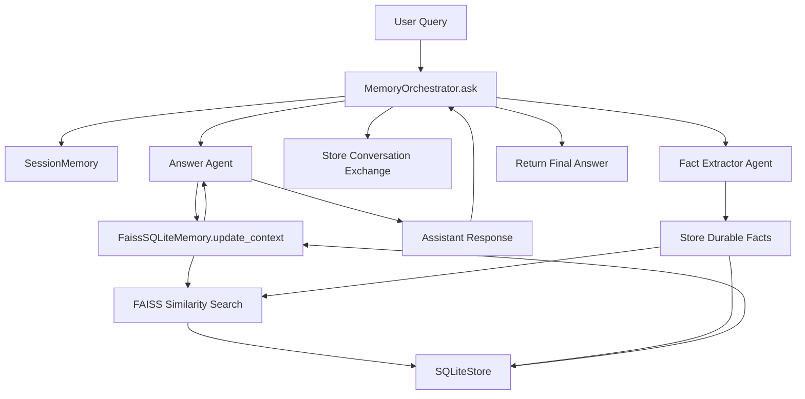
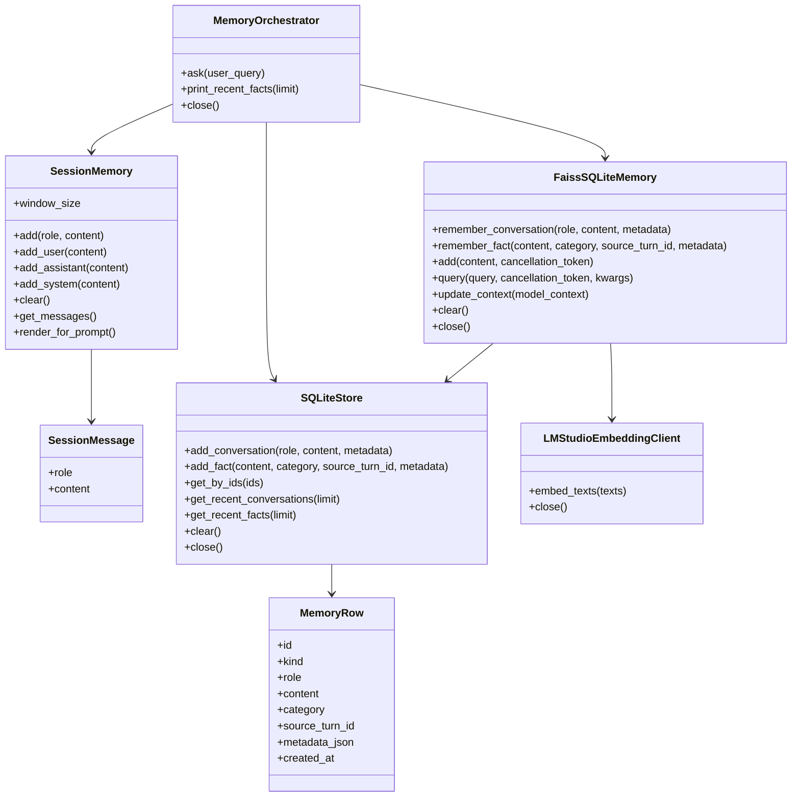
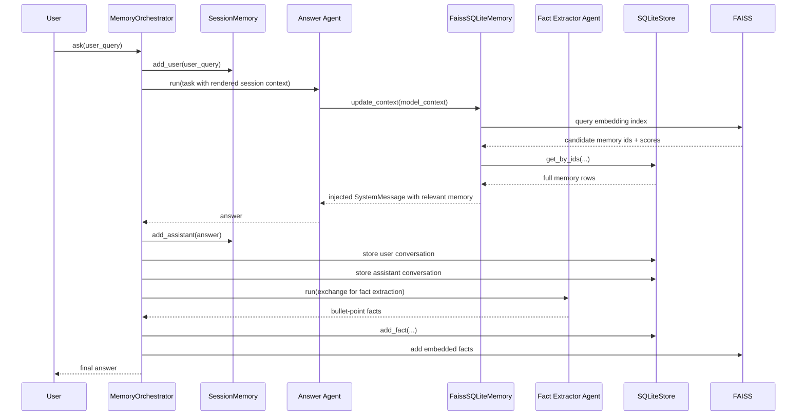
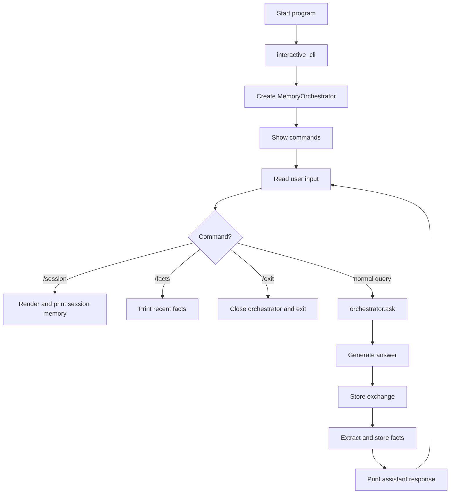

# Memory-Orchestrated Local AI Assistant

A memory-aware local AI assistant built with **AutoGen**, **LM Studio-compatible OpenAI endpoints**, **SQLite**, and **FAISS**.

This project implements a two-layer memory architecture:

1. **Short-term session memory** for recent turns in the active conversation
    
2. **Long-term persistent memory** for stored conversations and extracted durable facts
    

At runtime, the assistant answers the current query using:

- the latest user message
    
- recent session context
    
- relevant long-term memory retrieved through vector similarity search when applicable
    

---

## 1. Purpose

The goal of this project is to build a local assistant that can:

- maintain recent conversational context in memory
    
- persist useful information across sessions
    
- retrieve relevant long-term memories for future questions
    
- extract and store durable facts from prior user/assistant exchanges
    
- operate through a CLI interface using local-model infrastructure
    

---

## 2. Scope

This system is a **memory orchestration layer**, not a generic tool-calling assistant.

It does **not** implement:

- external tool execution
    
- web browsing
    
- database query agents beyond the internal memory store
    
- multi-agent task decomposition for planning/workers
    
- RAG over external documents
    

It **does** implement:

- recent-turn session memory
    
- persistent conversation storage
    
- durable fact extraction
    
- FAISS similarity retrieval
    
- AutoGen memory injection into the model context
    

---

## 3. High-Level Architecture



This system architecture reflects the actual interaction among `MemoryOrchestrator`, `SessionMemory`, `SQLiteStore`, `FaissSQLiteMemory`, the answer agent, and the fact extractor agent.

---

## 4. Component Model



These are the actual core objects and dataclasses defined in the uploaded code.

---

## 5. Directory Structure

```text
.
├── data
├── .env
├── files.zip
├── .gitignore
├── logs
├── memory
│   ├── faiss.index
│   ├── faiss_meta.json
│   ├── __init__.py
│   ├── long_term.db
│   ├── session_memory.py
│   ├── sqlite_store.py
│   └── vector_store.py
├── MEMORY-SYSTEM.md
├── orchestrator
│   ├── __init__.py
│   └── memory_orchestrator.py
├── python_project_dump.md
└── requirements.txt
```

This is the structure present in the uploaded dump.

---

## 6. Core Design Decisions

### 6.1 Short-Term Memory

Short-term memory is implemented by `SessionMemory`, which stores only the most recent `N` messages using a bounded `deque`. The default window size is 10, and only non-empty messages are stored. `render_for_prompt()` converts the current session history into numbered lines such as `1. USER: ...` for injection into the answer prompt.

### 6.2 Long-Term Memory

Long-term memory is split across two layers:

- **SQLite** stores durable records and full conversation entries
    
- **FAISS** stores vector embeddings for similarity search
    

This design separates **persistence** from **semantic retrieval**.

### 6.3 Fact-Oriented Indexing

Only **facts** are embedded into FAISS. Conversations are written to SQLite through `remember_conversation()`, but vector indexing is performed in `remember_fact()` after embedding text through `LMStudioEmbeddingClient`. As a result, similarity retrieval is fact-centric rather than full-conversation retrieval.

### 6.4 Retrieval-Augmented Context Injection

`FaissSQLiteMemory.update_context()` inspects the latest `UserMessage` in the AutoGen model context, queries the FAISS index, reconstructs full records from SQLite, formats the matches, and injects them into the chat context as a `SystemMessage`.

---

## 7. Runtime Flow



This sequence exactly matches the `ask()` workflow plus the storage and retrieval logic in `MemoryOrchestrator` and `FaissSQLiteMemory`.

---

## 8. Data Flow Summary

The runtime data path is:

1. the user message enters session memory
    
2. the answer agent receives the current prompt plus recent session context
    
3. long-term memory may inject retrieved facts into the model context
    
4. the final answer is returned
    
5. the exchange is persisted to SQLite
    
6. the exchange is sent to a fact-extractor agent
    
7. extracted durable facts are stored in SQLite and embedded into FAISS for future retrieval
    

---

## 9. Module Responsibilities

## `memory/session_memory.py`

Defines:

- `SessionMessage`
    
- `SessionMemory`
    

Responsibilities:

- maintain bounded recent-turn memory in RAM
    
- store `user`, `assistant`, and `system` roles
    
- render recent context into a prompt-friendly string
    

## `memory/sqlite_store.py`

Defines:

- `MemoryRow`
    
- `SQLiteStore`
    

Responsibilities:

- initialize and manage the `memories` table
    
- persist conversation and fact records
    
- retrieve rows by ID
    
- return recent conversations and facts
    
- clear or close the store
    

## `memory/vector_store.py`

Defines:

- `LMStudioEmbeddingClient`
    
- `FaissSQLiteMemory`
    

Responsibilities:

- call LM Studio’s embedding endpoint
    
- normalize vectors with `faiss.normalize_L2`
    
- manage a `faiss.IndexFlatIP` index
    
- map vector hits back to SQLite rows
    
- inject retrieved memories into AutoGen context
    

## `orchestrator/memory_orchestrator.py`

Defines:

- prompts for the answer agent and fact extractor
    
- `MemoryOrchestrator`
    
- the CLI entrypoint `interactive_cli()`
    

Responsibilities:

- initialize all memory layers
    
- build answer and fact-extractor agents
    
- compose the answer task with session context
    
- persist the conversation
    
- extract durable facts
    
- expose `/session`, `/facts`, and `/exit` commands in the CLI
    

---

## 10. Storage Model

### 10.1 SQLite Table Schema

The SQLite store creates a single table named `memories` with the following columns:

- `id`
    
- `kind`
    
- `role`
    
- `content`
    
- `category`
    
- `source_turn_id`
    
- `metadata_json`
    
- `created_at`
    

It also creates indexes on:

- `kind`
    
- `category`
    
- `source_turn_id`
    
- `created_at`
    

### 10.2 Record Types

The code stores two record kinds:

- `conversation`
    
- `fact`
    

Conversations are categorized as `episodic` when written via `add_conversation()`. Facts default to `semantic` unless another category is explicitly supplied.

### 10.3 Fact Categories

Allowed categories are instructed in the fact-extractor prompt as:

- `semantic`
    
- `preference`
    
- `constraint`
    
- `project`
    
- `episodic`
    

---

## 11. Retrieval Model

The retrieval layer uses:

- `faiss.IndexFlatIP`
    
- L2-normalized vectors
    
- top-`k` search
    
- a configurable score threshold
    
- duplicate filtering by `memory_id`
    

Because vectors are normalized before indexing and querying, inner-product search behaves as cosine-style similarity scoring in practice. The default retrieval settings are:

- `k = 4`
    
- `score_threshold = 0.35` unless overridden by environment variables.
    

---

## 12. Prompting Strategy

### 12.1 Answer Agent

The answer agent is instructed to:

- prioritize the current user query
    
- use recent session context when helpful
    
- use long-term memory only when relevant
    
- avoid inventing memories
    
- prefer the latest user message if it conflicts with retrieved memory
    

### 12.2 Fact Extractor Agent

The fact extractor is instructed to:

- analyze one user/assistant exchange
    
- keep only durable memory-worthy information
    
- avoid storing greetings, filler, or one-off fluff
    
- return bullet points in the format  
    `- fact text | category=semantic`
    

### 12.3 Fact Parsing

The parsed fact output is capped to the first **5** items by `_parse_fact_lines()` to keep memory growth tighter.

---

## 13. Configuration

The orchestrator expects these environment variables:

```env
LM_STUDIO_BASE_URL=<chat-and-embeddings-base-url>
LM_STUDIO_API_KEY=lm-studio
LM_STUDIO_CHAT_MODEL=<chat-model-name>
LM_STUDIO_EMBED_MODEL=<embedding-model-name>

SESSION_WINDOW_SIZE=10
VECTOR_TOP_K=4
VECTOR_SCORE_THRESHOLD=0.35

SQLITE_DB_PATH=memory/long_term.db
FAISS_INDEX_PATH=memory/faiss.index
FAISS_META_PATH=memory/faiss_meta.json
```

These names and defaults are defined directly in `MemoryOrchestrator.__init__()`.

---

## 14. CLI Interface

The interactive CLI supports:

- `/session` → show current short-term session memory
    
- `/facts` → show recent long-term facts
    
- `/exit` → close the application
    

The displayed startup banner is `"Day 4 Memory Orchestrator is ready."`, which indicates this code is organized as a memory-focused milestone in your broader project progression.

---

## 15. Execution Diagram for the CLI



This diagram reflects the exact command handling and interaction loop in `interactive_cli()`.

---

## 16. Non-Functional Characteristics

### 16.1 Persistence

Conversation and fact data persist across runs through SQLite and the FAISS index files located under `memory/`.

### 16.2 Bounded Session State

Short-term memory is bounded by the configurable session window and therefore does not grow indefinitely during a single session.

### 16.3 Retrieval Precision Controls

The system uses configurable `top_k` and `score_threshold` values to control how much long-term memory is injected into the answer context.

### 16.4 Separation of Concerns

The architecture cleanly separates:

- session memory
    
- persistent store
    
- vector retrieval
    
- orchestration
    
- fact extraction
    

---

## 17. Current Strengths

- clear layered memory architecture
    
- persistent long-term storage
    
- vector-based semantic retrieval
    
- explicit session memory
    
- durable fact extraction pipeline
    
- clean module separation
    
- CLI observability through `/session` and `/facts`
    
- AutoGen-compatible memory injection design
    

---

## 18. Current Limitations

Based on the uploaded code, the current implementation has the following practical limits:

- only facts are embedded for retrieval; conversations are stored but not indexed semantically
    
- retrieval depends on the latest user message only
    
- no summarization or compaction pipeline for old long-term memories
    
- no deletion/update policy for individual memories beyond global clear operations
    
- no external tool use, document retrieval, or web access
    
- no structured confidence scoring beyond similarity score and threshold filtering
    
- the requirements file includes `sentence-transformers`, but the visible uploaded code performs embeddings through LM Studio’s OpenAI-compatible endpoint via `AsyncOpenAI`, not through `sentence-transformers` directly
    

---

## 19. How to Run

Install dependencies:

```bash
pip install -r requirements.txt
```

Run the CLI:

```bash
python orchestrator/memory_orchestrator.py
```

This matches the provided module structure and the `if __name__ == "__main__": asyncio.run(interactive_cli())` entrypoint in the orchestrator file.

---

## 20. Simple Mental Model

You can explain the system like this:

- **SessionMemory** remembers the recent chat
    
- **SQLiteStore** keeps permanent records
    
- **FAISS** helps find relevant old facts
    
- **Answer Agent** answers with current context plus retrieved memory
    
- **Fact Extractor Agent** decides what is worth remembering for the future
    

---

## 21. Summary

This project is a **memory-centric local assistant architecture** with a clean split between short-term context, persistent long-term storage, and vector-based semantic retrieval. The assistant answers the current question, persists the exchange, extracts durable facts, embeds those facts, and later retrieves relevant memories when similar queries appear again.

---
